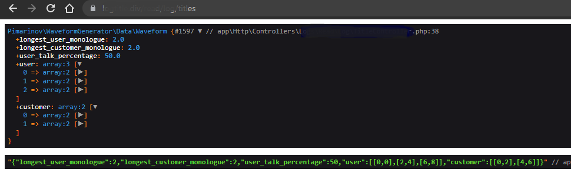
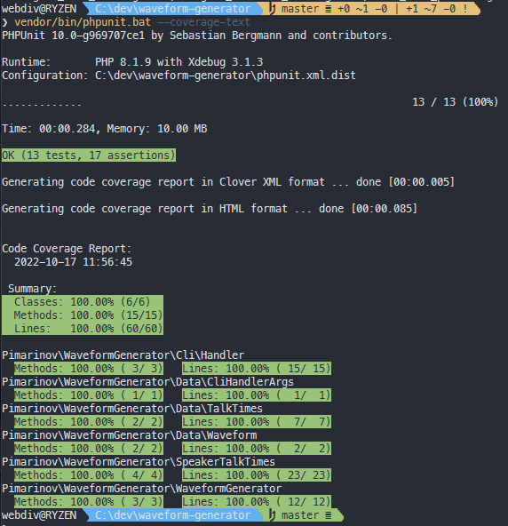

# Waveform Generator - Backend Task | [backend-task.md](backend-task.md)

The goal of this package is to make Waveform object from the silence raw data
of both conversation participants ([User](tests/example-raw-silence/user-channel.txt) & [Customer](tests/example-raw-silence/customer-channel.txt)).

## Installation

Install via Composer:

```bash
composer require pimarinov/waveform-generator
```

## Usage

1. The raw Silence need be converted to talk-times for both speakers;
2. The talk-times couple is used to generate the conversation's waveform object;
3. For json response output, call the buil-in `Waveform::json(int $flags = 0)` method.

```php
use Pimarinov\WaveformGenerator\SpeakerTalkTimes;
use Pimarinov\WaveformGenerator\WaveformGenerator;

$waveform = (function ($userRawSilenceFilePath, $customerRawSilenceFilePath): Waveform {

    $userSilence = file_get_contents($userRawSilenceFilePath);
    $customerSilence = file_get_contents($customerRawSilenceFilePath);

    $userTalkTimes = (new SpeakerTalkTimes($userSilence))
        ->getTalkTimes();

    $customerTalkTimes = (new SpeakerTalkTimes($customerSilence))
        ->getTalkTimes();

    return (new WaveformGenerator($userTalkTimes, $customerTalkTimes))
            ->getWaveform();

})();

print_r($waveform->json());

```



## CLI

This package has built-in cli handler, allowing calls via Console:

```bash
php bin/waveform.php --user tests/dummy-raw-silence/user.dummy-raw-silence.txt --customer tests/dummy-raw-silence/customer.dummy-raw-silence.txt
```

Output:

```bash
{"longest_user_monologue":2,"longest_customer_monologue":2,"user_talk_percentage":50,"user":[[0,0],[2,4],[6,8]],"customer":[[0,2],[4,6]]}
```

## Testing

```bash
vendor/bin/phpunit --coverage-text
```

Output
```bash
PHPUnit 10.0-g969707ce1 by Sebastian Bergmann and contributors.

Runtime:       PHP 8.1.9 with Xdebug 3.1.3
Configuration: C:\dev\waveform-generator\phpunit.xml.dist

.............                                                     13 / 13 (100%)

Time: 00:00.281, Memory: 10.00 MB

OK (13 tests, 17 assertions)

Generating code coverage report in Clover XML format ... done [00:00.005]

Generating code coverage report in HTML format ... done [00:00.071]


Code Coverage Report:
  2022-10-17 11:49:39

 Summary:
  Classes: 100.00% (6/6)
  Methods: 100.00% (15/15)
  Lines:   100.00% (60/60)

Pimarinov\WaveformGenerator\Cli\Handler
  Methods: 100.00% ( 3/ 3)   Lines: 100.00% ( 15/ 15)
Pimarinov\WaveformGenerator\Data\CliHandlerArgs
  Methods: 100.00% ( 1/ 1)   Lines: 100.00% (  1/  1)
Pimarinov\WaveformGenerator\Data\TalkTimes
  Methods: 100.00% ( 2/ 2)   Lines: 100.00% (  7/  7)
Pimarinov\WaveformGenerator\Data\Waveform
  Methods: 100.00% ( 2/ 2)   Lines: 100.00% (  2/  2)
Pimarinov\WaveformGenerator\SpeakerTalkTimes
  Methods: 100.00% ( 4/ 4)   Lines: 100.00% ( 23/ 23)
Pimarinov\WaveformGenerator\WaveformGenerator
  Methods: 100.00% ( 3/ 3)   Lines: 100.00% ( 12/ 12)

```



## Docker

1. Build

```bash
docker build -t waveform-generator .

```

2. Run

```bash
docker run --rm -it waveform-generator bash

```

And within the container you can run tests: `vendor/bin/phpunit --coverage-text` 

or the cli-handler
```bash
php bin/waveform.php --user tests/dummy-raw-silence/user.dummy-raw-silence.txt --customer tests/dummy-raw-silence/customer.dummy-raw-silence.txt
```

## License

The MIT License (MIT). Please see [License File](LICENSE.md) for more information.
